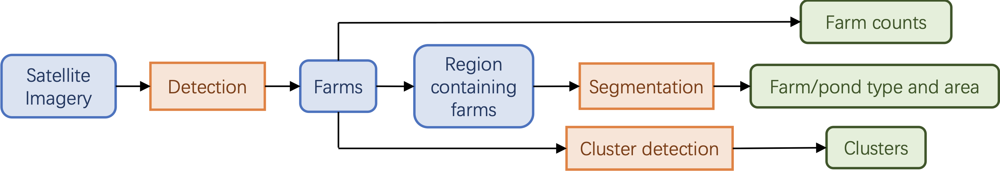

# Yangon Chickenfish

This is a satellite image object detection and clustering model based on YOLOv4 (https://github.com/WongKinYiu/PyTorch_YOLOv4).


## 1 Model

### 1.1 pipeline overview



With the satellite images as input, we first crop the images into fixed sizes and detect all chicken farms using an object detection model. Then, we do the following post-processing steps: (1) counting; (2) re-cropping the satellite images aroung chicken houses and segment the chicken house buildings and fish ponds, calculating their total area sizes; (2) detect clusters using a cluster detection algorithm.

### 1.2 algorithm 

- detection: Based on YOLOv4. Trained with annotated data to output axis-aligned bounding boxes on images countaining chicken farms. When counting, bounding boxes are transformed into spatial locations (latitude and longtitude), and farms that are detected more than once in overlapping satellite images are removed. Corresponding code dir: ```src/detection```

- segmentation：Based on U-net. Trained with annotated data to output per-pixel likelihood of belonging to fish ponds or rooftops of chicken houses. For each rooftop, the model also predicts one of two possible rooftop materials, thatch and zinc. Corresponding code dir: ```src/segmentation```

- cluster detection：Farms with distance less than a threshold D are considered to be within a cluster. We use a search algorithm to find all non-overlapping clusters. Corresponding code dir: ```src/cluster_detection```

- statistics: After the previous steps, we calculate the total statistics (mean rooftop area, percentage of zinc and thatch roofs, mean cluster size, etc). Corresponding code dir: ```src/stats```


## 2 Installation

### 2.1 system requirements

The code is written with Python. We have tested the code with Ubuntu 20.04 and Ubuntu 22.04, both using Python 3.9. However, the code should be also compatible with other operating systems, including Windows, OSX, and Linux.

### 2.2 python environment

We recommend installing the python environment using acaconda or miniconda. The installation typically takes several minutes on a normal desktop computer.

```
## create python environment
conda create -n satellite python=3.9
conda activate satellite

## install pytorch with cuda
conda install pytorch==2.4.1 torchvision==0.19.1 torchaudio==2.4.1 pytorch-cuda=12.4 -c pytorch -c nvidia
pip install pycocotools tensorboard

## install required packages with latest version
pip install opencv-python numpy matplotlib tqdm pillow gdown pyyaml scipy segmentation_models_pytorch
```
- For detection model, it is required to install mish-cuda：https://github.com/thomasbrandon/mish-cuda


### 2.3 pretrained models

- detection (save to ```src/detection/weights```): https://drive.google.com/file/d/1Q-f7G0RcclqtNnQvZWNNypB46WxNtJqP/view?usp=sharing

- roof segmentation (save to ```src/segmentation```): https://drive.google.com/file/d/1OlL5JLIGY696CUjfJ0liwzNPkuaFdDY2/view?usp=sharing

- water segmentation (save to ```src/segmentation```): https://drive.google.com/file/d/1bztV57OPKeotXNvXCoO43Qws6x8gRpyb/view?usp=sharing


## 3 Running the code

**Note:** We cannot provide the satellite images in this codebase due to its enormous size. We do provide a sample of **demo data** for detection results in ```src/cluster_detection/data``` and segmentation results in ```src/segmentation/result```. To test the code with only these provided results, please run the scripts that are marked as "**ready**". Unless specifically mentioned, all scripts are should run within several minutes on a normal desktop computer.

### 3.1 data preparation

- src/detection/images: satellite images after cropping to a fixed size
- src/detection/annotations: corresponding json annotation file

Preprocess training data:
```
cd src/detection/;
python preprocess/preprocess_train.py;
```

### 3.2 detection
Training: (typically takes several hours depending on computer's GPU power)
```
cd src/detection/;
bash scripts/train.sh;
```

Testing: 
```
cd src/detection/;
bash scripts/test.sh;
```

Inference:
```
cd src/detection/;
python preprocess/preprocess_detect.py;
bash scripts/detect.sh;
```

### 3.3 segmentation
Training: (typical running time ranges from several minutes to several hours)
```
cd src/segmentation/;
python main.py;
```

Inference:
```
cd src/segmentation/;
python make_buffer.py;
python inference.py;
python post_process.py;
```

### 3.4 cluster detection
Detection results must be copied to the ```src/cluster_detection/raw``` directory.

Preprocessing:
```
cd src/cluster_detection/;
python nms.py;  # remove farms detected more than once
```

Detection **(ready)**:
```
python detect.py;  # detect clusters
```

### 3.5 stats

Reproduce the statistics **(ready)**:
```
cd src/stats;
python get_stats.py
```

